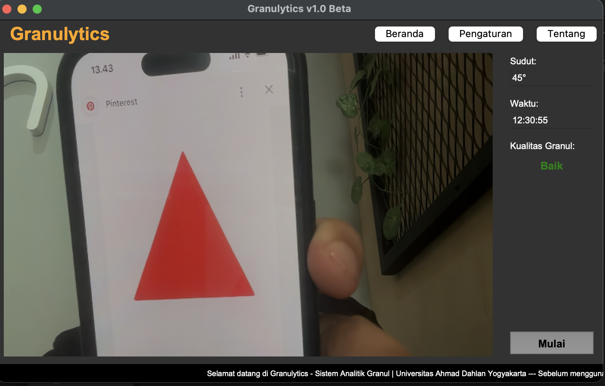
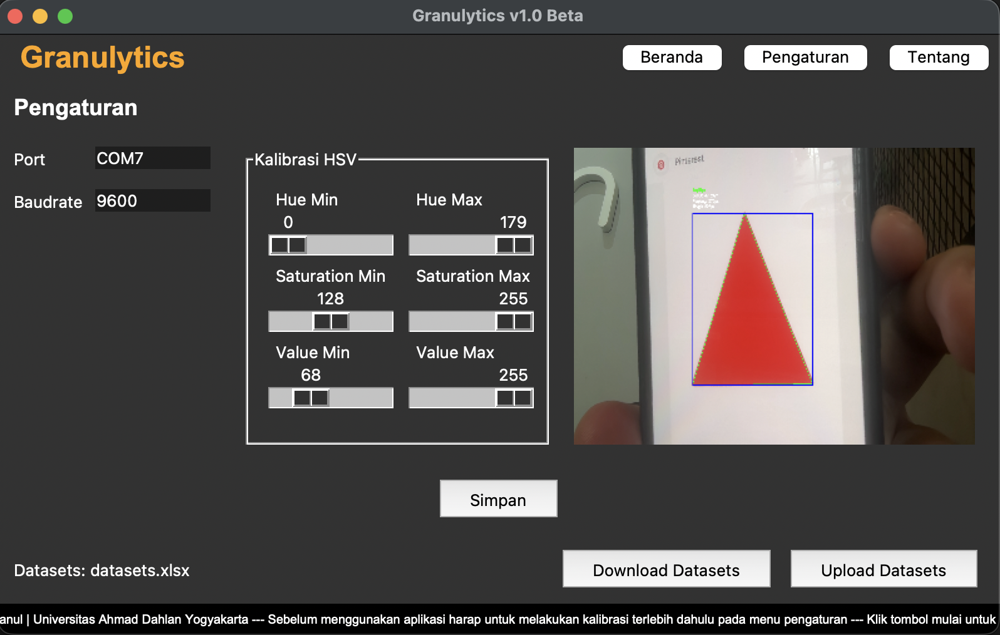
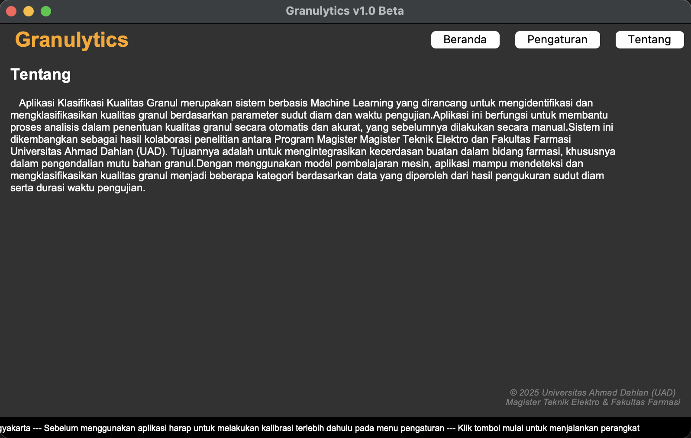

<!--
 Copyright 2025 ariefsetyonugroho
 
 Licensed under the Apache License, Version 2.0 (the "License");
 you may not use this file except in compliance with the License.
 You may obtain a copy of the License at
 
     https://www.apache.org/licenses/LICENSE-2.0
 
 Unless required by applicable law or agreed to in writing, software
 distributed under the License is distributed on an "AS IS" BASIS,
 WITHOUT WARRANTIES OR CONDITIONS OF ANY KIND, either express or implied.
 See the License for the specific language governing permissions and
 limitations under the License.
-->

# 📦 Project Name  
Aplikasi Klasifikasi Kualitas Granul merupakan sistem berbasis Machine Learning
yang dirancang untuk mengidentifikasi dan mengklasifikasikan kualitas granul
berdasarkan parameter sudut diam dan waktu pengujian. Aplikasi ini berfungsi untuk membantu proses analisis dalam penentuan kualitas granul secara otomatis dan akurat, yang sebelumnya dilakukan secara manual. Sistem ini dikembangkan sebagai hasil kolaborasi penelitian antara Program Magister Magister Teknik Elektro dan Fakultas Farmasi Universitas Ahmad Dahlan (UAD).Tujuannya adalah untuk mengintegrasikan kecerdasan buatan dalam bidang farmasi, khususnya dalam pengendalian mutu bahan granul. Dengan menggunakan model pembelajaran mesin, aplikasi mampu mendeteksi dan mengklasifikasikan kualitas granul menjadi beberapa kategori berdasarkan data yang diperoleh dari hasil pengukuran sudut diam serta durasi waktu pengujian."

## ✨ Features  
- [X] Realtime Camera Preview
- [ ] Result Classification 
- [X] Setting Configuration
- [X] About Application 

## ⚙️ Installation & 🚀 Usage 
- Clone Project
```
git clone https://github.com/ASNProject/granul-detection-v2.git
```
- Buka Project
```
cd project_name
```
- Install requirements
```
pip install -r requirements.txt
```
- Run Project
```
python main.py
```


## Notes
- Create requirements.txt
```
pip freeze > requirements.txt
```

- If only library used
```
pip install pipreqs
pipreqs . --force
pipreqs project_name --force (Jika mau update)
```

## Screenshoot
<p align="center">
  
  
  
</p>
